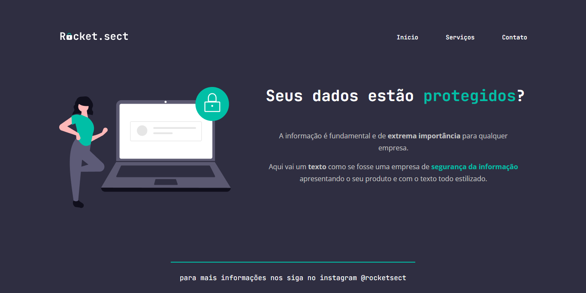

<h1 align="center">Recriando Layout Extra</h1>

Desafio do Stage 02 (Introdução ao HTML e CSS) da Rocketseat. 
Com base no layout dispnibilizado no Figma, recriei a aplicação em html e css.

 

## 🛠 Tecnologias

Esse projeto foi desenvolvido com as seguintes tecnologias:

- HTML e CSS
- Figma

## 💻 Projeto

## 📝 Licença

Esse projeto está sob a licença MIT.

## 🙋🏻‍♂️ Autor

Feito com 💙 por Murillo Ressineti

