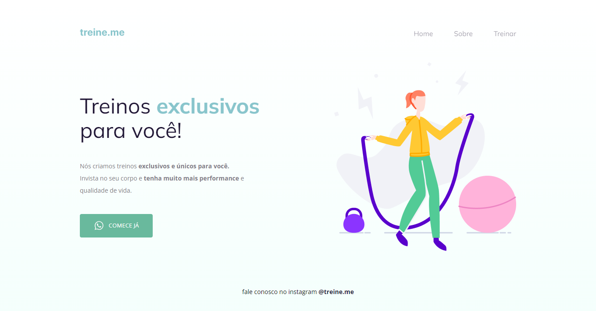

<h1 align="center">Semântica e Acessibilidade</h1>

Desafio do Stage 02 (Introdução ao HTML e CSS) da Rocketseat. 
Recebi um código apenas separados com divs, adicionei semântica e acessibilidade.

 

## 🛠 Tecnologias

Esse projeto foi desenvolvido com as seguintes tecnologias:

- HTML e CSS

## 💻 Projeto

## 📝 Licença

Esse projeto está sob a licença MIT.

## 🙋🏻‍♂️ Autor

Feito com 💙 por Murillo Ressineti.

