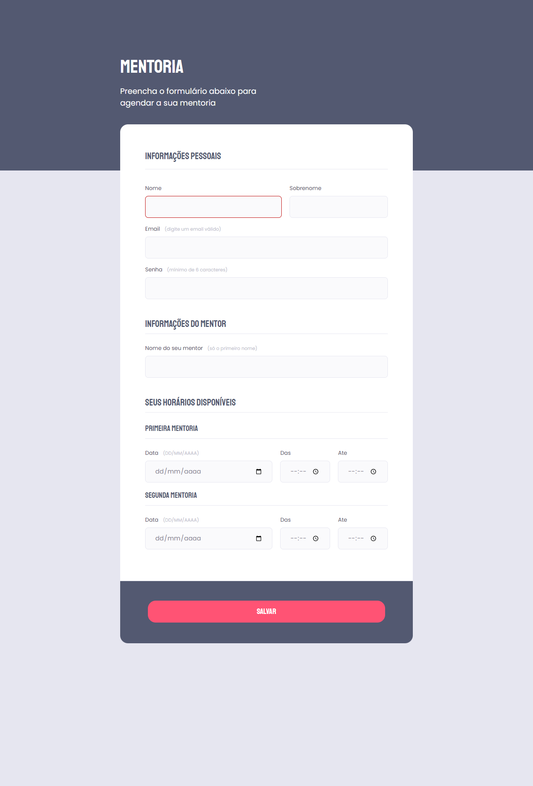

<h1 align="center">Criando Formulários</h1>

Desafio do Stage 03 (Avançando no HTML e CSS) da Rocketseat. 
Recebi um layout de um formulário no Figma e recriei utilizando os aprendizados do stage 03.

 

## 🛠 Tecnologias

Esse projeto foi desenvolvido com as seguintes tecnologias:

- HTML e CSS
- Figma

## 💻 Projeto

## 📝 Licença

Esse projeto está sob a licença MIT.

## 🙋🏻‍♂️ Autor

Feito com 💙 por Murillo Ressineti

