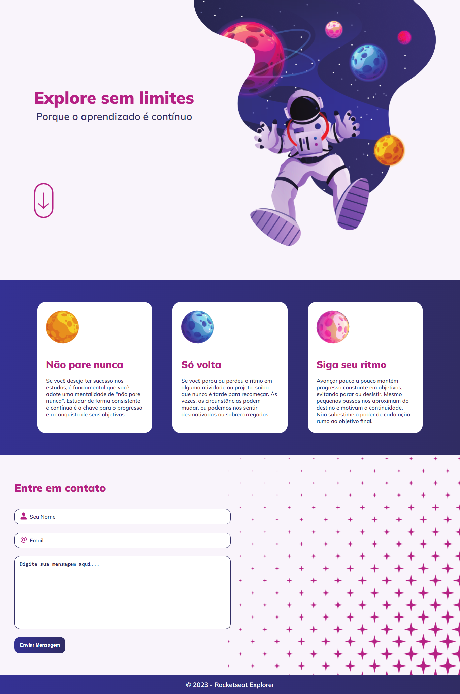

<h1 align="center">Explore Sem Limites</h1>

Desafio do Intensivão - Níveis 01 a 04 da Rocketseat. 
Recebi um layout no Figma e recriei utilizando os aprendizados do stage 01 a 04.

 

## 🛠 Tecnologias

Esse projeto foi desenvolvido com as seguintes tecnologias:

- HTML e CSS
- Figma

## 💻 Projeto

## 📝 Licença

Esse projeto está sob a licença MIT.

## 🙋🏻‍♂️ Autor

Feito com 💙 por Murillo Ressineti

