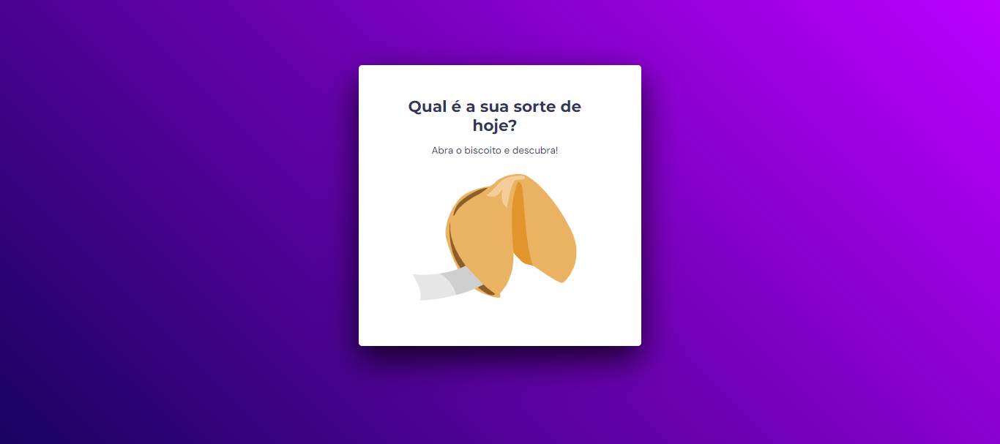
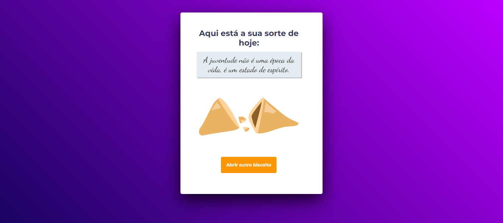

<h1 align="center">Biscoito da Sorte</h1>

Desafio do Stage 05 - Avançando no JavaScript da Rocketseat. 
Neste desafio, apliquei os conceitos aprendidos em JavaScript para criar uma função. Ao clicar em um biscoito, a página muda e exibe uma frase gerada dinamicamente. Essa prática consolidou o conhecimento, destacando a interatividade proporcionada pelo JavaScript.

 

## 🛠 Tecnologias

Esse projeto foi desenvolvido com as seguintes tecnologias:

- HTML e CSS
- JavaScript
- Figma

## 💻 Projeto

## 📝 Licença

Esse projeto está sob a licença MIT.

## 🙋🏻‍♂️ Autor

Feito com 💙 por Murillo Ressineti.

