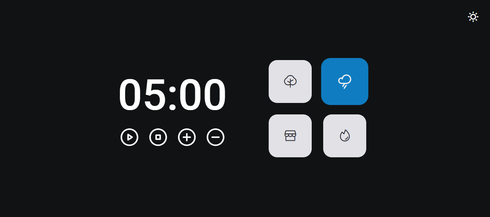

<h1 align="center">Focus Timer</h1>

Desafio do Stage 05 - Avançando no JavaScript da Rocketseat. 
Implementei os conhecimentos de JavaScript, com destaque para o uso de ES Modules para organizar o código em diversos arquivos. O projeto resultante é um 'focus timer' inspirado no método de estudo Pomodoro, permitindo adicionar 5 minutos ao tempo de estudo e escolher entre 4 temas de áudio para acompanhar a sessão.

 

## 🛠 Tecnologias

Esse projeto foi desenvolvido com as seguintes tecnologias:

- HTML e CSS
- JavaScript
- Figma

## 💻 Projeto

## 📝 Licença

Esse projeto está sob a licença MIT.

## 🙋🏻‍♂️ Autor

Feito com 💙 por Murillo Ressineti.

