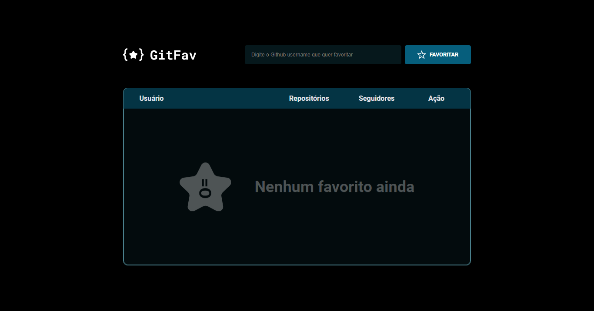

<h1 align="center">GitFav</h1>

Desafio do Stage 06 - JavaScript antes do framework da Rocketseat. 
Durante a realização deste projeto, explorei e aplicai diversos conceitos fundamentais de Programação Orientada a Objetos (PPO) como classes, herança, polimorfismo, imutabilidade, tratamento de erros e o uso do LocalStorage.
O propósito principal dessa iniciativa foi estabelecer uma comunicação eficiente com a API do GitHub, visando aprimorar a experiência do usuário ao possibilitar a marcação de favoritos diretamente na aplicação.

 

## 🛠 Tecnologias

Esse projeto foi desenvolvido com as seguintes tecnologias:

- HTML e CSS
- JavaScript
- Figma

## 💻 Projeto

## 📝 Licença

Esse projeto está sob a licença MIT.

## 🙋🏻‍♂️ Autor

Feito com 💙 por Murillo Ressineti.

