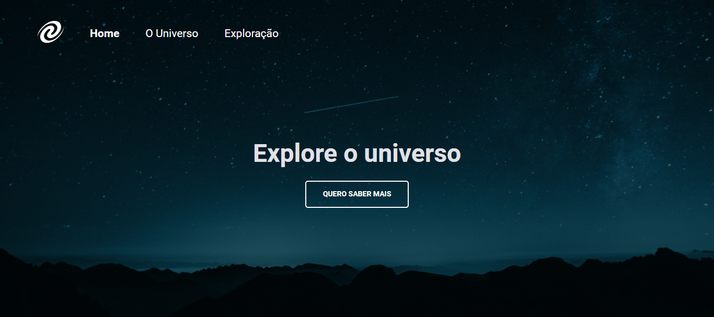
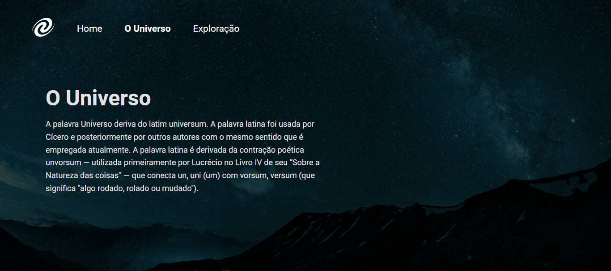

<h1 align="center">SPA Universe</h1>

Desafio do Stage 06 - JavaScript antes do Framework. 
Este projeto consiste em uma página institucional desenvolvida com base nos princípios de SPA (Single Page Application), utilizando mapeamento de rotas, assincronicidade e promises. A implementação segue uma abordagem orientada a objetos, fazendo uso de classes para estruturar e organizar o código de maneira eficiente

 

## 🛠 Tecnologias

Esse projeto foi desenvolvido com as seguintes tecnologias:

- HTML e CSS
- JavaScript
- Figma

## 💻 Projeto

## 📝 Licença

Esse projeto está sob a licença MIT.

## 🙋🏻‍♂️ Autor

Feito com 💙 por Murillo Ressineti.

