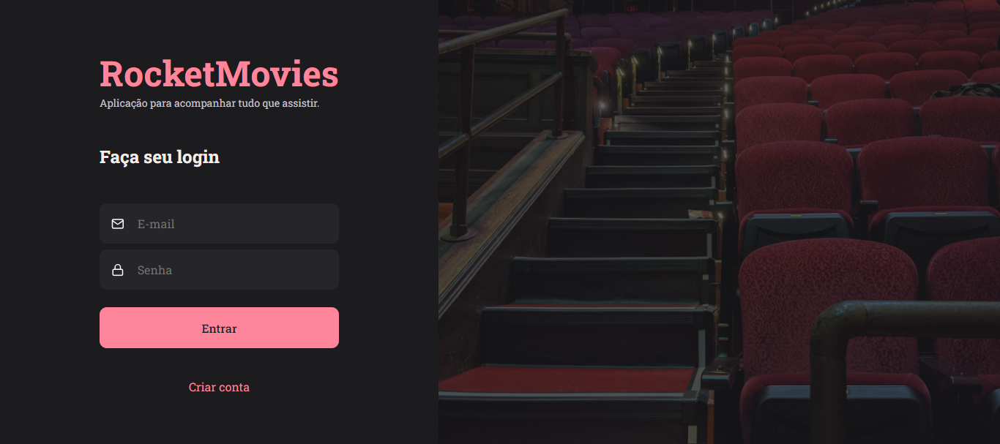

<h1 align="center">RocketMovies</h1>

<p align="center">
Desafio do Stage 09 - Introdução ao ReactJS<br/>
Nesta etapa, concentrei-me na criação do front-end do projeto, permitindo a interface visual para que o usuário cadastre filmes e preencha informações como nome, descrição e nota, além de criar tags relacionadas.

Utilizei o ViteJS para estruturar o projeto de forma eficiente, styled-components para estilização, e React Router para navegação, garantindo uma experiência de usuário intuitiva e agradável.
</p>

<br>

## 🛠 Tecnologias

Esse projeto foi desenvolvido com as seguintes tecnologias:

- ReactJS
- ViteJS
- Styled Components
- React Router

## 💻 Projeto



## ⚙️ Utilização

1. instale as dependências com: ``` cd rocketmovies ```
2. inicie o projeto com: ``` npm install ```
3. execute a migrations para criação do banco de dados: ``` npm run dev```

## 📝 Licença

Esse projeto está sob a licença MIT.

## 🙋🏻‍♂️ Autor

Feito com 💙 por Murillo Ressineti.

[](https://www.linkedin.com/in/murilloressineti/)