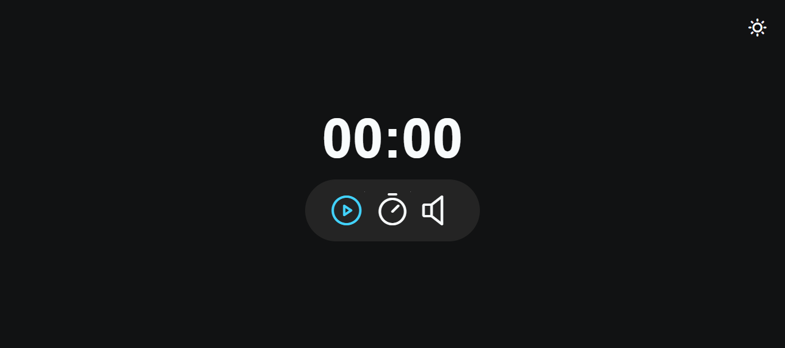

<h1 align="center">Focus Timer</h1>

Projeto feito durante o Stage 05 (Avançando no JavaScript) da Rocketseat. 
Durante o stage 05, desenvolvi este projeto, explorando conceitos como ES Modules para estruturar o código em diversos arquivos. O resultado é um 'focus timer', permitindo ajustar o tempo de estudo até 60 minutos, escolher entre ouvir ou não música de fundo, e optar pelo 'light mode' ou 'dark mode'.

 

## 🛠 Tecnologias

Esse projeto foi desenvolvido com as seguintes tecnologias:

- HTML e CSS
- JavaScript
- Figma

## 💻 Projeto

## 📝 Licença

Esse projeto está sob a licença MIT.

## 🙋🏻‍♂️ Autor

Feito com 💙 por Murillo Ressineti.

