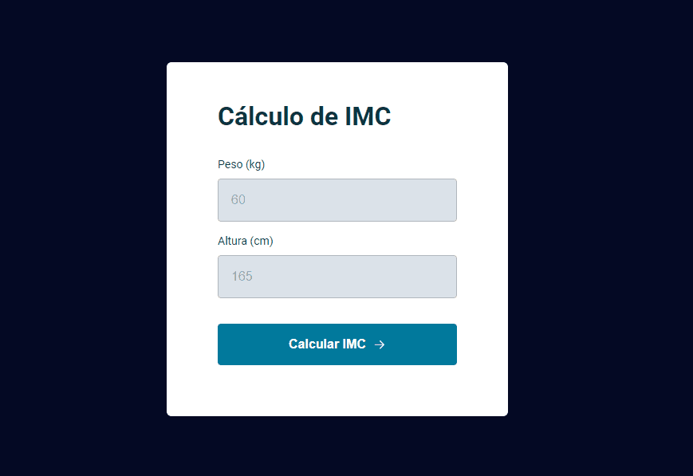

<h1 align="center">Calculadora de IMC</h1>

Projeto feito durante o Stage 05 (Avançando no JavaScript) da Rocketseat. 
Neste projeto, foquei na aplicação do JavaScript, assim como a aplicação dos modais.

 

## 🛠 Tecnologias

Esse projeto foi desenvolvido com as seguintes tecnologias:

- HTML e CSS
- JavaScript

## 💻 Projeto

## 📝 Licença

Esse projeto está sob a licença MIT.

## 🙋🏻‍♂️ Autor

Feito com 💙 por Murillo Ressineti.

